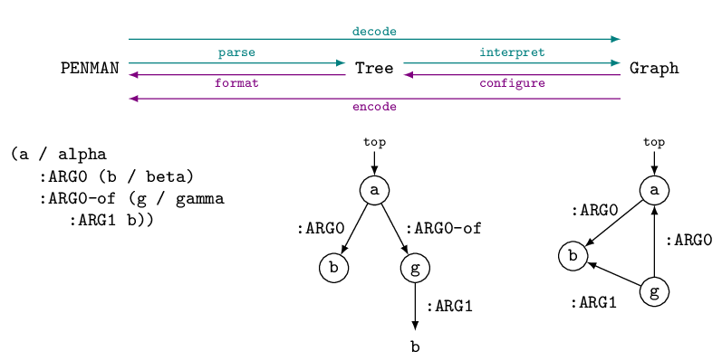

Trees, Graphs, and Epigraphs
============================

On the surface, the structures encoded in PENMAN Notation (see
:doc:`here <notation>`) are a tree, and only by resolving repeated
node identifiers (variables) as reentrancies does the actual graph
become accessible. The Penman library thus accommodates the three
stages of a structure: the linear PENMAN string, the surface
:class:`tree <penman.tree.Tree>`, and the pure :class:`graph
<penman.graph.Graph>`. Going from a string to a tree is called
**parsing**, and from a tree to a graph is **interpretation**, while
the whole process (string to graph) is called **decoding**. Going from
a graph to a tree is called **configuration**, and from a tree to a
string is **formatting**, while the whole process is called
**encoding**. These processes are illustrated by the following figure
(concepts are not shown on the tree and graph for simplicity):

..
   Normally the tikz code is used to generate the image, but there is
   an issue preventing the necessary library from being installed, so
   until that's fixed just use a pre-built version.

   https://github.com/sphinx-contrib/tikz/issues/13

..
   .. tikz::
      :libs: arrows,positioning

      [every node/.style={font=\ttfamily\scriptsize,text height=1.5ex,text depth=.8ex},
       var/.style={draw,circle,inner sep=0},
       reentrancy/.style={draw=none,fill=none,text height=1ex,text depth=0},
       proc/.style={-latex,every node/.style={font=\ttfamily\tiny}},
       top/.style={label={[font=\ttfamily\tiny,anchor=base,yshift=.5ex]above:top}}]
      \node[draw=none] (X) {};
      \node[below=0ex of X] (P) {PENMAN};
      \node[right=8em of P] (T) {Tree};
      \node[right=8em of T] (G) {Graph};
      (P) -- (T) -- (G);

      \node [below=5ex of P,xshift=1em,draw=none,text badly ragged,
	     label={[align=left]below:(a / alpha\\~~~:ARG0 (b / beta)\\~~~:ARG0-of (g / gamma\\~~~~~~:ARG1 b))}]
	     (Pa) {};

      \coordinate[top,below=5ex of T] (TTop);
      \node[var,below=2ex of TTop] (Ta) {a};
      \node[var,below=4ex of Ta,xshift=-1.5em] (Tb) {b};
      \node[var,below=4ex of Ta,xshift=1.5em] (Tg) {g};
      \node[reentrancy,below=4ex of Tg] (Tb2) {b};
      \draw[-latex] (TTop) -- (Ta);
      \draw[-latex] (Ta) -- (Tb) node [midway,left] {:ARG0};
      \draw[-latex] (Ta) -- (Tg) node [midway,right] {:ARG0-of};
      \draw[-latex] (Tg) -- (Tb2) node [midway,right] {:ARG1};

      \coordinate[top,below=5ex of G] (GTop);
      \node[var,below=2ex of GTop] (Ga) {a};
      \node[var,below=3ex of Ga,xshift=-3em] (Gb) {b};
      \node[var,below=6ex of Ga] (Gg) {g};
      \draw[-latex] (GTop) -- (Ga);
      \draw[-latex] (Ga) -- (Gb) node [near start,left] {:ARG0};
      \draw[-latex] (Gg) -- (Ga) node [midway,right] {:ARG0};
      \draw[-latex] (Gg) -- (Gb) node [near start,below left] {:ARG1};

      \draw[proc,color=teal,transform canvas={yshift=0.5ex}] (P) -- (T) node[midway,above=-.5ex] {parse};
      \draw[proc,color=teal,transform canvas={yshift=0.5ex}] (T) -- (G) node[midway,above=-.5ex] {interpret};
      \draw[proc,color=violet,transform canvas={yshift=-0.5ex}] (G) -- (T) node[midway,below=-.5ex] {configure};
      \draw[proc,color=violet,transform canvas={yshift=-0.5ex}] (T) -- (P) node[midway,below=-.5ex] {format};
      \draw[proc,color=teal,transform canvas={yshift=2.5ex}] (P) -- (G) node[midway,above=-.5ex] {decode};
      \draw[proc,color=violet,transform canvas={yshift=-2.5ex}] (G) -- (P) node[midway,below=-.5ex] {encode};

Conversion from a PENMAN string to a :class:`~penman.tree.Tree`, and
vice versa, is straightforward and lossless. Conversion to a
:class:`~penman.graph.Graph`, however, is potentially lossy as the
same graph can be represented by different trees. For example, the
graph in the figure above could be serialized to any of these PENMAN
strings::

  (a / alpha                (a / alpha                     (a / alpha
     :ARG0 (b / beta)          :ARG0 (b / beta                :ARG0 (b / beta
     :ARG0-of (g / gamma          :ARG1-of (g / gamma))          :ARG1-of (g / gamma
        :ARG1 b))              :ARG0-of g)                          :ARG0 a)))

Even more serializations are possible if you do not require the first
occurrence of a variable to define the node (with its node label
(concept) and outgoing edges), or if you allow other nodes to be the
top.

The Penman library therefore introduces the concept of the
**epigraph** (not to be confused with other senses of *epigraph*, such
as an inscription on a building or a passage at the beginning of a
book), which is information on top of the graph that instructs the
:class:`codec <penman.codec.PENMANCodec>` how the graph should be
serialized. The epigraph is thus analagous to the idea of the
`epigenome <https://en.wikipedia.org/wiki/Epigenome>`_: epigenetic
markers controls how genes are expressed in an individual as the
epigraphical markers control how graph triples are expressed in a tree
or string. Separating the graph and the epigraph thus allow the graph
to be a pure representation of the triples expressed in a PENMAN
serialization without losing information about the surface form.

There are currently two kinds of epigraphical markers: layout markers
and surface alignment markers. Surface alignment markers are parsed
from the string and stored in the tree then propagated to the graph
upon interpretation. Layout markers are created when the tree is
interpreted into a graph. When an edge goes to a new node and not a
constant or variable, a :class:`~penman.layout.Push` marker is
inserted. When a node ends, a :attr:`~penman.layout.POP` marker is
inserted. With these markers, and the ordering of triples, the graph
can be configured to a specific tree structure.

